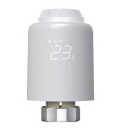
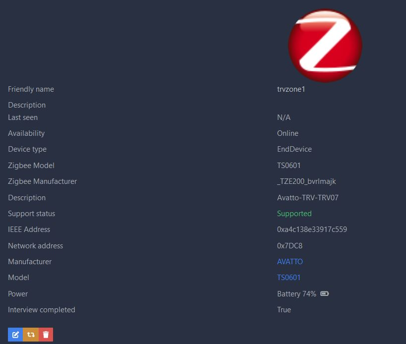
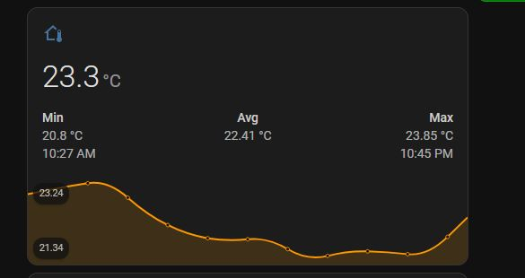
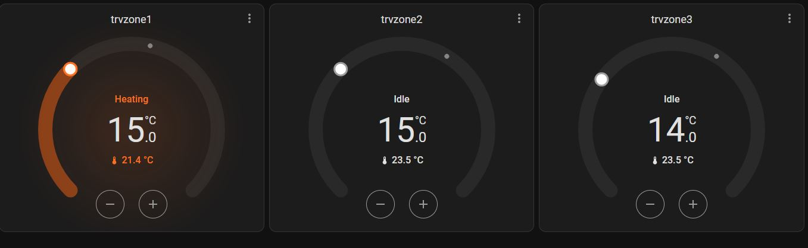

#  External convertor for:  TRV Valve Avatto-TRV07-TS0601 Zigbee2MQTT
#  ManufacturerName:   _TZE200_bvrlmajk



The convertor has been tested and worked fine with Zigbee2MQTT fresh installed.

Thanks for help and contribution to improve code :
  MacDada Dawid Nowak
  TFTDgh
  
  
[climate.trv_room_3](https://github.com/TFTDgh)

## Please don't associate or report  issues related to problems by supported devices provided by Zigbee2MQTT. 
## This external convertor has been created before Zigbee2MQTT to  publish support for this type of TRV valve and was not implemented on their supported devices database.

## Installation on Zigbee2MQTT version older than 2.00
Upload tuyats601.js to zigbee2mqtt folder.
Add to zigbee2mqtt/configuration.yaml 

```bash
external_converters:
  - tuyats601.js
  - other_convertor.js
```
Restart zigbee2MQTT service and start to pair devices. 

In mostly  times it is necessary to re-pair two times each device in order to configured on zigbee GUI
## Installation on Zigbee2MQTT version greater than 2.00
On folder zigbee2mqtt create new folder named "external_converters" and place external convertor file in this director.


## Usage

This TRV can be used in Home Assistant with automations or  topics MQTT.

Example to create temperature sensor from TRV valve in Home Assistant

Add to /homeassistant/configuration.yaml under mqtt config:

```bash
mqtt:
  sensor:
  - name: "trvzone1_temperature"
    state_topic: "zigbee2mqtt/trvzone1"
    unique_id: trvzone1temperature
    unit_of_measurement: "°C"
    device_class: "temperature"
    qos: 0
    value_template: "{{ (value|from_json)['local_temperature'] }}"
```
Restart Home Assistant to take effect.

## Presentation
About 



Temperature sensor 



Climate TRV on Home Assistant



On exposes GUI can be found below options


# Scheduler 


#  Display brightness Level, Screen orientation, Climate Mode


## Helper source :

https://github.com/zigpy/zha-device-handlers/issues/2750
    
https://github.com/Koenkk/zigbee-herdsman-converters/blob/master/src/devices/tuya.ts

## License
[GPL](https://choosealicense.com/licenses/gpl-3.0/)
Avatto TRV07 TS0601 converter
Original implementation by eteodun, Mar 21, 2024
Licensed under GPL-3.0
